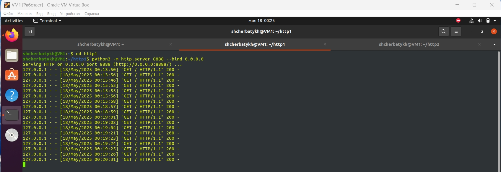

# Домашнее задание к занятию "Кластеризация и балансировка нагрузки" - `Щербатых А.Е.`
## Задание 1
Запустите два simple python сервера на своей виртуальной машине на разных портах

Установите и настройте HAProxy, воспользуйтесь материалами к лекции по [ссылке](https://github.com/netology-code/sflt-homeworks/blob/main/2)

Настройте балансировку Round-robin на 4 уровне.

На проверку направьте конфигурационный файл haproxy, скриншоты, где видно перенаправление запросов на разные серверы при обращении к HAProxy.

### Выполнение
1. Два simple python сервера запущены
   
    
      
    
3. Установлен и запущен HAProxy, пример перенаправления запросов на разные серверы при обращении к HAProxy:
   

   

   Файл конфигурации [haproxy_HW_1.cfg](files/haproxy_HW_1.cfg)

   ## Задание 2
   Запустите три simple python сервера на своей виртуальной машине на разных портах
   
   Настройте балансировку Weighted Round Robin на 7 уровне, чтобы первый сервер имел вес 2, второй - 3, а третий - 4
   
   HAproxy должен балансировать только тот http-трафик, который адресован домену example.local
   
   На проверку направьте конфигурационный файл haproxy, скриншоты, где видно перенаправление запросов на разные серверы при обращении к HAProxy c использованием домена example.local и без него.

    ### Выполнение
   Перенаправление запросов на разные серверы при обращении к HAProxy c использованием домена example.local
   
    

   Перенаправление запросов на разные серверы при обращении к HAProxy без домена example.local
   

    Файл конфигурации [haproxy_HW_2.cfg](files/haproxy_HW_2.cfg)
   

   
